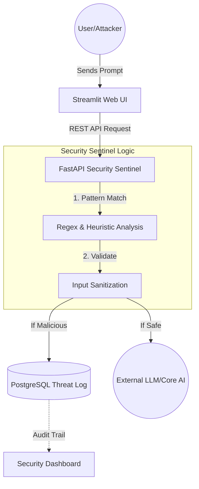

[](https://github.com/Pradyum-1712/AI-Shield-Sentinel/actions/workflows/main.yml)
# 🛡️ AI-Shield Sentinel: End-to-End Secure LLM Gateway

AI-Shield is a containerized microservices architecture designed to protect Large Language Models (LLMs) from **Adversarial Prompt Injections** and **Jailbreak attacks**. 

## 🏗️ System Architecture



[Image of a professional software architecture diagram showing a 3-tier system: Streamlit Frontend, FastAPI Backend, and PostgreSQL Database connected via Docker networks]

## 🚀 Key Features
- **Security Sentinel:** FastAPI-based backend that uses heuristic analysis to detect malicious prompt patterns (e.g., Payload Splitting, DAN-mode, and System Overrides).
- **Microservices Architecture:** Orchestrated using Docker Compose, featuring isolated Frontend, Backend, and Database layers.
- **Threat Intelligence:** Every blocked attack is persisted to a **PostgreSQL** database for forensic auditing.
- **M2 Optimized:** Tailored for Apple Silicon (ARM64) high-performance containerization.

## 🛠️ Tech Stack
- **Frontend:** Streamlit
- **Backend:** FastAPI
- **Database:** PostgreSQL 15
- **Infrastructure:** Docker & Docker Compose

## 🚦 How to Run (M2 Mac)
1. **Clone the repo:**
   ```bash
   git clone git@github.com:Pradyum-1712/AI-Shield-Sentinel.git
   cd AI-Shield-Sentinel
   ```
2. **Launch the stack:**
   ```bash
   docker compose up --build
   ```

## 🧠 Academic Connection
This project implements security principles discussed in my published research on AI in Cybersecurty Compliance and Montioring regarding data integrity and adversarial patterns in machine learning environments.

